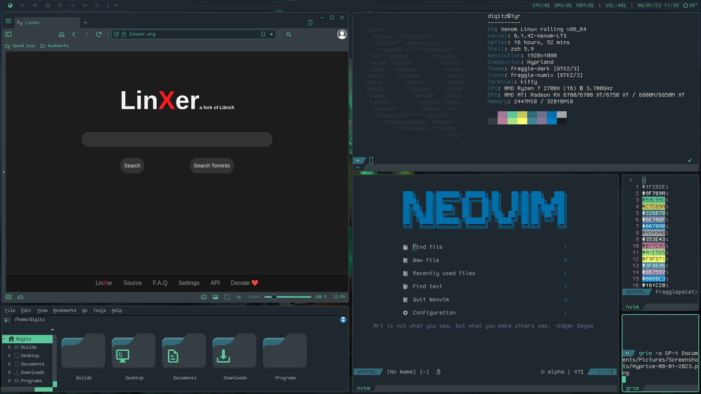

# Color Files
Fraggle color scheme color files, just point your configs to them or pull colors out of them.

## fraggle-dark.tar.gz
This can be extracted into your ~/.themes folder or wherever you keep your GTK+/QT themes stored.
Afterwards you can use something like lxappearance and qt5ct or qt6ct to set the fraggle-dark theme for your GTK+/QT apps.

